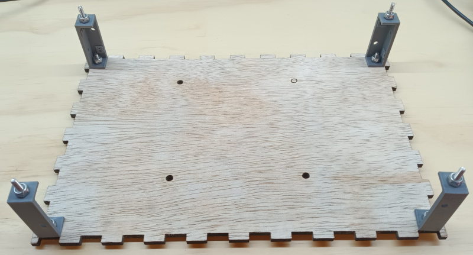
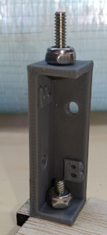
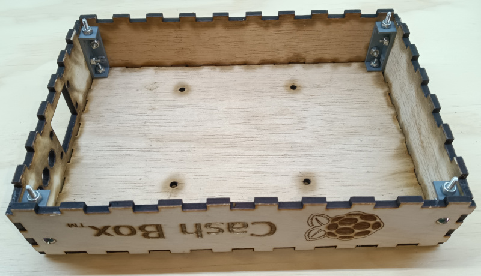
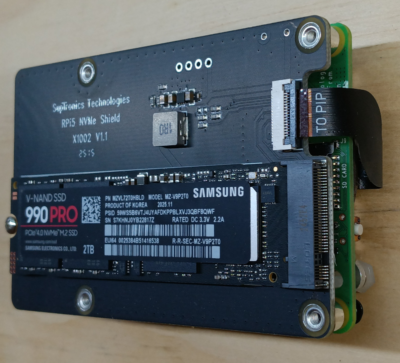
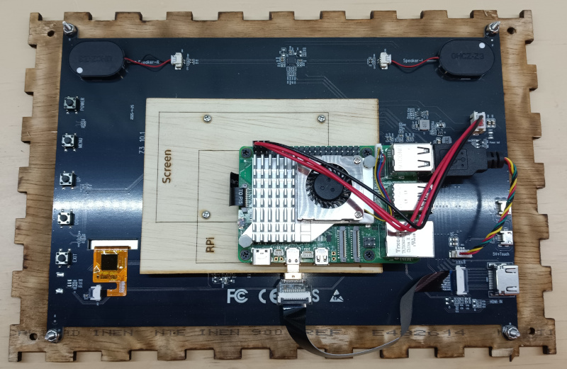

# Assembly

This page gives an overview of how to connect the various pieces of the Cash Box together.

## The Box

The first step is to mount the corner brackets to the back plate of the box:

The corner brackets have a 'B' which should face the back plate of the box. The 'F' should face the front of the box. Use #6-32 x 5/8" truss head machine screws with nylock nuts.

Attach the sides of the box. Use #6-32 x 5/8" truss head machine screws to secure the sides to the plastic corner brackets.

## NVMe Hat

Use the [NVMe to USB adapter](https://amzn.to/49MOF0j) to load the Ubuntu ISO onto the NVMe SSD. Then assemble the HAT and NVMe onto the back of the Raspberry Pi:

## The Screen

Assembled the screen, screen frame, and Raspberry Pi. 

- Use #4-40 and nylock nuts to mount the touch screen to the wood frame.
- Connect the wood offset to the screen, and then the Raspberry Pi to the wood offeset, using the M3 machine screws.
- Pay close attention to the connection of the red and black wires to the pins on the Raspberry Pi. It should go red-red-black from left to right.
- Plug in the HDMI and USB cables.

Finally, the screen can be placed into the front of the box. The power cord for the Raspberry Pi can be woven between the three holes in the side of the box. And acorn nuts can be finger-tightened onto the 6x32 machine screws sticking out the front of the screen. That will keep the screen tightly attached to the box.