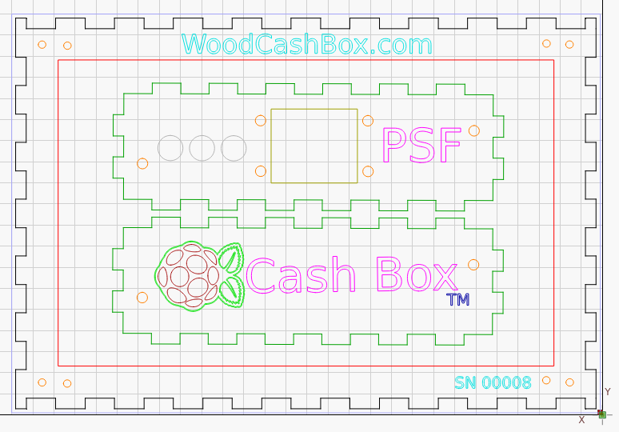
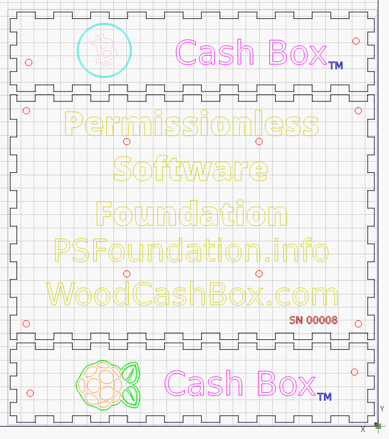
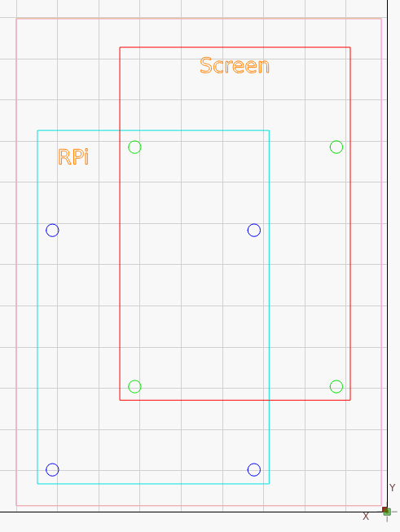

# Laser & 3D

The Cash Box housing is designed around the touch screen. If the screen manufacture redesigns or stops selling the screen, a new version of the housing will be released to house a new screen.

The design files are version-tracked in a Github repository:
- [Design Files Repository](https://github.com/christroutner/cash-box)

The files are released as Lightburn files, as that software seems to be the 'industry standard' for hobby laser engravers. If you need it in a different format, reach out on the [Support channel](./support.md). Both the cutting and engraving happen in the same file, listed as different layers within the file. Engraving happens before cutting, to reduce the chance of parts moving unexpectedly.

## Laser Cutting & Engraving

There are three main laser engraving files.

## Screen and Short Sides

The touch screen mount and the two short sides are contained in *screen-mount.lbrn2*.

## Back and Long Sides

The back and the long sides of the box are contained in *back-and-sides.lbrn2*.

## Pi Mount

Because the NVMe HAT is on the bottom of the Raspberry Pi, the mount on the touchscreen can not be used directly. This offset plate allows the Pi with the HAT to be mounted to the touchscreen.

