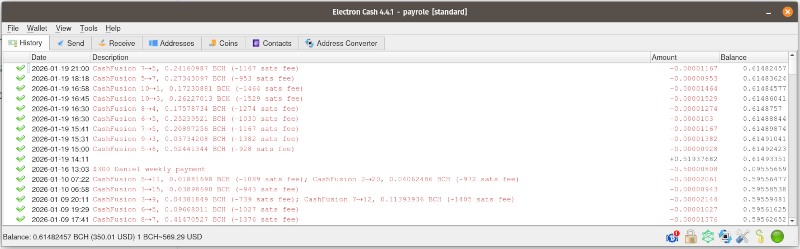
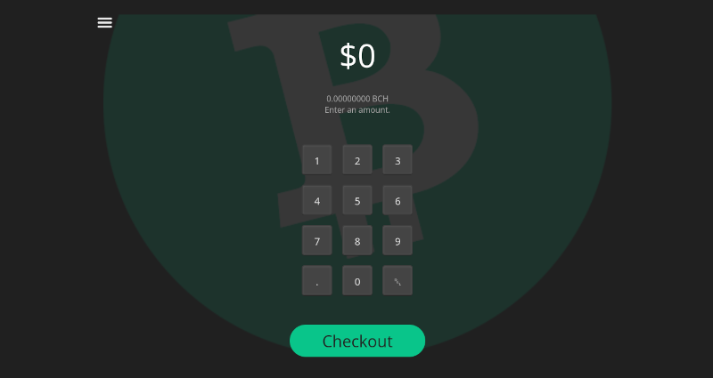
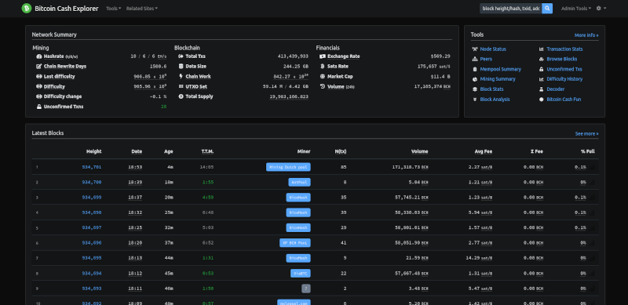

# Software

The Cash Box implements the software infrastructure listed in the [Cash Stack](https://cashstack.info), which includes the following infrastructure:
  - [BCHN](https://bitcoincashnode.org/en/) full node
  - [Fulcrum](https://github.com/cculianu/Fulcrum) indexer
  - [SLP Token](https://slp-tokens.com) indexer
  - [bch-api](https://cashstack.info/docs/back-end/psf-bch-api) REST API
  - [ipfs-file-pin-service](https://cashstack.info/docs/IPFS/file-storage) IPFS file network

In addition to the infrastructure above, these handy applications ship with a fully-assembled version:

## Electron Cash

[Electron Cash Wallet](https://electroncash.org/) is the most advanced Bitcoin Cash wallet in the ecosystem. It gives you access to the [Cash Fusion](https://cashfusion.org/) Network. When combined with the [Fulcrum indexer](https://github.com/cculianu/Fulcrum) running locally on the Cash Box, you have the best financial privacy possible in BCH. 

Electron Cash does not support the ARM64 architecture of the Raspberry Pi. An unmaintained fork of [v4.2.3 for ARM64](https://github.com/christroutner/Electron-Cash) was created specifically for the Cash Box.

## Point of Sale

[POS.cash](https://pos.cash/) is a simple web app that lets merchants easily accept Bitcoin Cash for goods and services, as a Point Of Sale (POS). It allows for easy *receiving* of BCH. Spending requires a secret PIN number. This allows staff to accept BCH on behalf of the store, but only mangement can spend the funds. 

The Cash Box can easily be mounted to the wall, using the 4 mounting holes on the back. Or it can easily sit on a counter top. The touch screen makes it perfect for use as a Point of Sale device.

## Block Explorer

[Bitcoin Cash Explorer](https://bch.loping.net/) is a block explorer that is popular with software developers. The same user interface is [published on GitHub](https://github.com/sickpig/bch-rpc-explorer). Fully-assembled Cash Boxes come with this same block explorer software, without any rate limits and not dependencies on any third parties. This very helpful software for auditing funds or debugging transactions.

